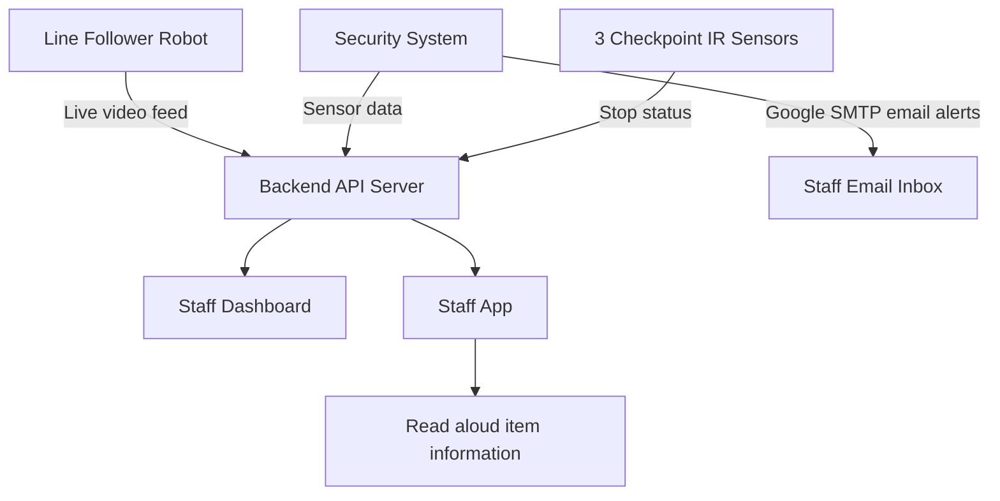
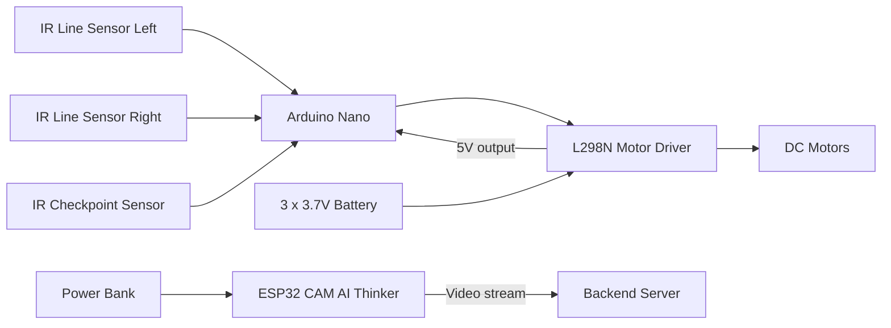
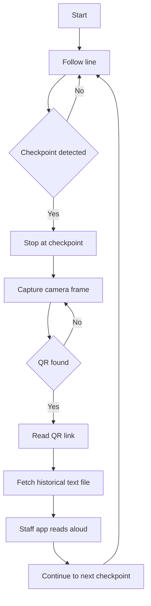
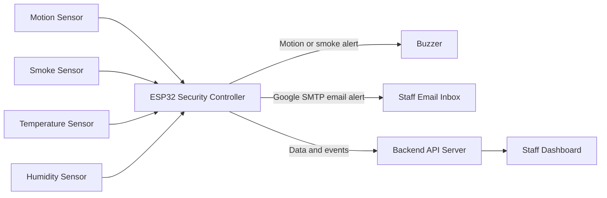
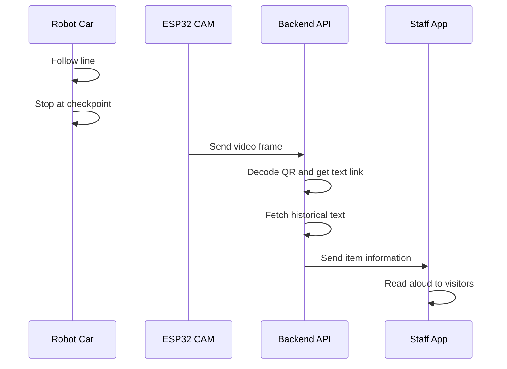

# Museum Automation System

Simple system overview for your museum robot and security setup.

## System Goal

The system helps visitors learn about historical items while improving museum safety.

- A robot follows a floor line.
- It stops at checkpoints.
- The camera scans a QR code at each stop.
- The server gets the text link from the QR code.
- The staff app reads the item information aloud.
- A security system watches motion, smoke, temperature, and humidity.

## High Level Architecture

## Robot Hardware

### Main Controllers

- Arduino Nano
  - 2 IR sensors for line following
  - 1 IR sensor for checkpoint detection
  - Connected to L298N motor driver
- ESP32 CAM AI Thinker
  - Live video streaming to server

### Power Design

- Power bank powers ESP32 CAM board.
- 3 x 3.7V battery pack powers L298N and motors.
- Arduino Nano gets 5V from the L298N driver board.

### Robot Wiring Diagram

## Robot Behavior

## Security System

The security system reports to the same server.

- Detects motion
- Detects smoke
- Reports temperature
- Reports humidity
- Plays buzzer when motion or smoke is detected
- ESP32 security board sends email alert with Google SMTP when motion or smoke is detected
- Uses 3 checkpoint IR sensors to report robot stop status

## Server Features

- Backend API for robot and security data
- Dashboard for staff to monitor alerts and environment
- Video feed capture from ESP32 CAM
- Security alert events from ESP32 motion and smoke detection
- Google SMTP email alerts to staff for motion and smoke
- QR decode when robot is stopped
- Read text link from QR and fetch historical item text
- Send content to staff app for read aloud

## Simple End to End Flow

## Notes

- This design keeps robot control and video processing separated.
- It supports guided tours and live security monitoring at the same time.
